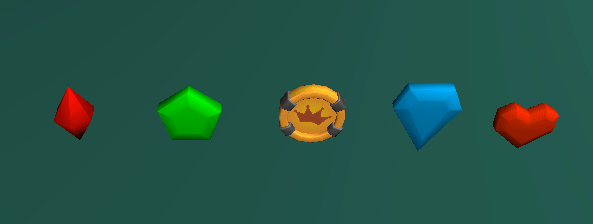
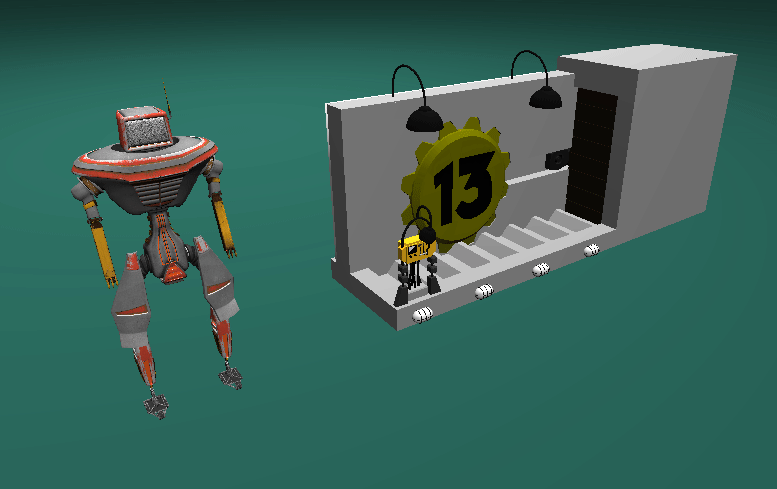

# Tanim

(T)imeline (Anim)ation Library for C++ projects based on ImGui & ENTT.



# About

Tanim is a timeline animation library that provides keyframe animation for C++ projects using ImGui and ENTT. It includes a timeline editor with cubic Bezier curve interpolation for the editor interface and runtime playback for animated scenes.

The library provides curve editing, keyframe manipulation, runtime sampling, and serialization. Animation data can be shared across multiple entities for animating hierarchies and creating reusable animation clips.

# Showcase

<p align="center">
  
  <br>
  <em>Rich Cubic Bezier Curve Editing</em>
</p>

<p align="center">
  
  <br>
  <em>Reusable Animations, Flexible Playback</em>
</p>

<p align="center">
  
  <br>
  <em>Multi-Sequence Timeline Editing</em>
</p>

<p align="center">
  
  <br>
  <em>Complex Multi-Property Animations</em>
</p>

# Features

- **Timeline Editor**: ImGui-based interface for creating and editing animation timelines
- **Cubic Bezier Curves**: Industry-standard curve interpolation with configurable tangent modes (Auto, Smooth, Broken, Weighted)
- **Multi-Entity Animation**: Animate entity hierarchies with a single timeline asset
- **Component Reflection**: Simple macro-based system to make components with supported types animatable
- **Keyframe Editing**: Create, move, and delete keyframes with multi-selection support
- **Handle Manipulation**: Direct control over curve tangents with visual feedback
- **Curve Constraints**: Automatic monotonicity enforcement to prevent invalid animations
- **Runtime Playback**: Efficient sampling system with configurable playback modes (Loop, Once)
- **Serialization**: Save and load system for timeline data
- **Type Support**: Built-in support for common types (float, int, bool, glm::vec2, glm::vec3, glm::vec4, glm::quat)
- **Performance**: O(n) time complexity, capable of animating 15,000+ entities at 60 FPS

# Documentation

## Integration & API Reference

**[Integration Reference](integration-reference.md)** - Complete guide covering installation, getting started, architecture, data structures, reflection system, user overrides, API reference, and performance.

## Type Reference

**[Supported Types](supported-types.md)** - List of built-in animatable types and their behaviors.

## Editor Guide

**[UI & Shortcuts](ui-shortcuts.md)** - Editor controls, keyboard shortcuts, and mouse interactions.

## Complete Example

**[Example Implementation](example-implementation.md)** - Complete integration example showing component setup, editor integration, and runtime playback.

# Quick Example

```cpp
// 1. Initialize Tanim once at startup
tanim::Init();

// 2. Reflect your components (in global namespace)
TANIM_REFLECT(MyComponent, position, rotation, scale);

// 3. Call Draw and UpdateEditor each frame
void OnImGuiRender() {
    tanim::Draw();
    tanim::UpdateEditor(delta_time);
}

// 4. Update timelines during play mode
void OnUpdate() {
    tanim::UpdateTimeline(registry, entity_datas, tdata, cdata, delta_time);
}
```

See [Integration Reference](integration-reference.md) for the complete setup process.

# Future

- Quality of life improvements for the editor
- Custom type support system
- Event system for animation callbacks
- Standalone Bezier curve editor widget
- Potential Flecs ECS support

# License

MIT

---

This project is being developed during my studies as a 2nd year Engine & Tools student @ [Breda University of Applied Sciences](https://www.buas.nl/en/programmes/creative-media-and-game-technologies/programming).
