# Editor UI & Shortcuts

Guide to the Tanim timeline editor interface, keyboard shortcuts, and mouse interactions.

## Overview

The Tanim editor provides a timeline-based interface for creating and editing animations.

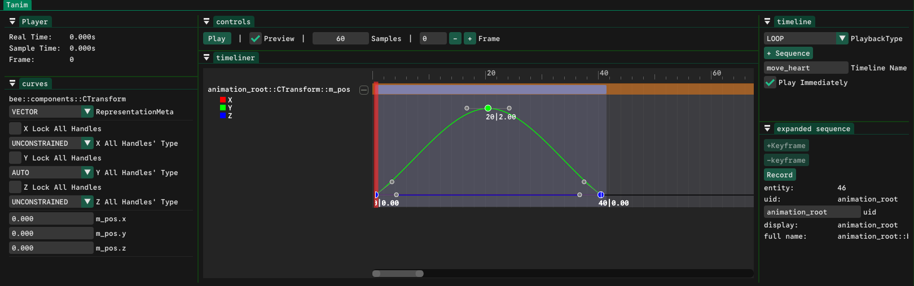

## Editor Layout

The editor window consists of several sections:

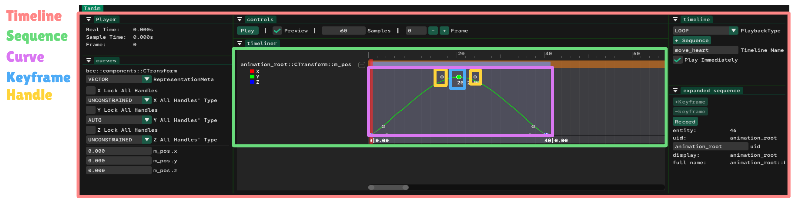

| Section               | Description                                                                                    |
| --------------------- | ---------------------------------------------------------------------------------------------- |
| **Tanim**             | Parent window of the tool                                                                      |
| **Controls**          | Playhead position and playback state controls                                                  |
| **Player**            | Detailed playhead position information                                                         |
| **Timeline**          | Information and controls for the entire timeline                                               |
| **Expanded Sequence** | Information and controls for the currently expanded sequence                                   |
| **Curves**            | Information and controls for all curves in the expanded sequence                               |
| **Timeliner**         | Displays sequences vertically. Expanding a sequence reveals its curves, keyframes, and handles |

## Common Workflow

1. Open a timeline for editing by calling [tanim::OpenForEditing](integration-reference.md#tanim%20OpenForEditing).

   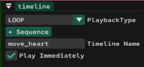

2. Click **+Sequence** in the Timeline window. All registered animatable fields from entities in the `EntityData` list appear. Select the parameter you want to animate.

   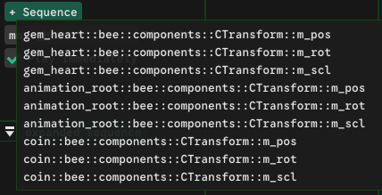

3. A new sequence appears in the Timeliner. Double-click to expand it.

   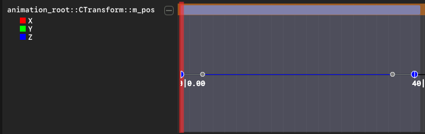

4. Curves appear based on the field type. Each curve has a distinct color and parameter name label.

   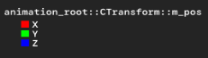

5. Click a curve's name to toggle its visibility. This helps when curves overlap or when focusing on a single curve. Visibility changes are visual only.

   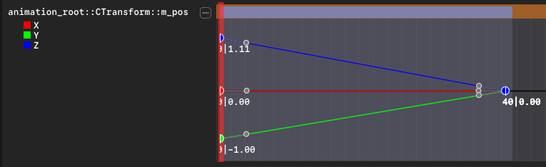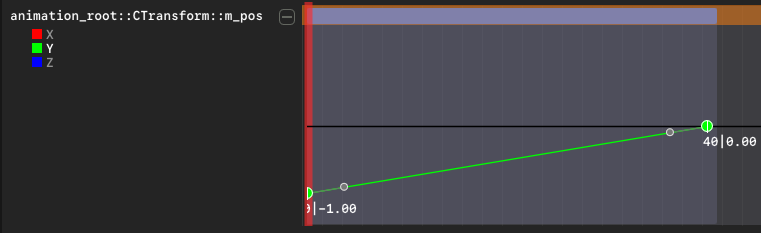

   The first value below a keyframe shows the frame number (X axis). The second shows its value (Y axis).

   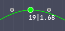

6. Modify keyframes and curves using the methods described in the following sections.

## Adding Keyframes

- **Double-click** on a curve at a position without an existing keyframe.
- Move the playhead to a frame without keyframes on all curves. The **+Keyframe** button in the expanded sequence enables. Click it to create a keyframe on all curves that don't have one at that frame.

  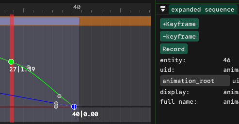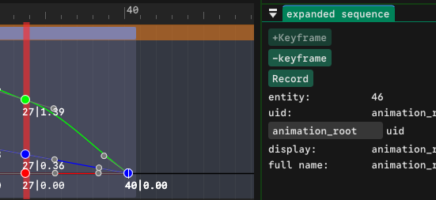

## Selecting Keyframes

Selected keyframes display a white diamond border.

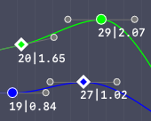

| Action                    | Result                                                                                                |
| ------------------------- | ----------------------------------------------------------------------------------------------------- |
| **Left-click** keyframe   | Select single keyframe                                                                                |
| **Click-drag** empty area | Create selection box                                                                                  |
| **Drag** selected         | Move all selected keyframes                                                                           |
| **Shift-click** keyframe  | Add to selection (includes all keyframes between previous selection and clicked keyframe)             |
| **Shift-drag** empty area | Add to selection without clearing existing selection                                                  |
| **Shift-click** curve     | Hover over a curve (turns white), then shift-click empty space on curve to select all keyframes on it |
| **Ctrl-click** keyframe   | Toggle keyframe selection                                                                             |

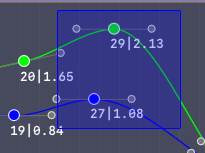 => 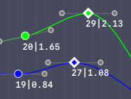

_Click-drag empty area_

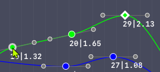 => 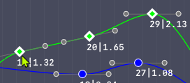

_Shift-click keyframe_

## Deleting Keyframes

- **Right-click** a keyframe or selection and choose **Delete Keyframe** from the context menu.
- Select keyframes and press **DEL**.
- Move the playhead to a frame with keyframes. The **-Keyframe** button enables. Click it to delete all keyframes at the playhead position.

  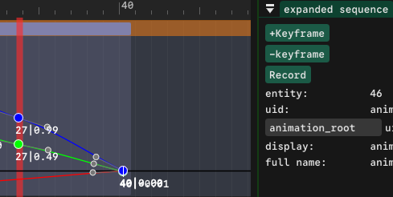 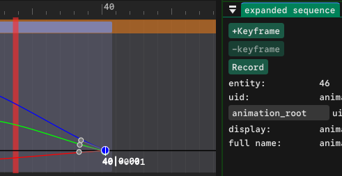

**Note:** The context menu disables **Delete Keyframe** when deletion is restricted. Restrictions apply to first/last keyframes on a curve and to quaternion sequences. In quaternion sequences, use the **-Keyframe** button to delete keyframes.

## Modifying Keyframes

- **Drag** selected keyframes to reposition them.
- **Right-click** a keyframe and select **Edit keyframe**. The playhead moves to that frame, and the curve parameters become editable in the Curves window. Changing values updates the keyframe's Y value.

  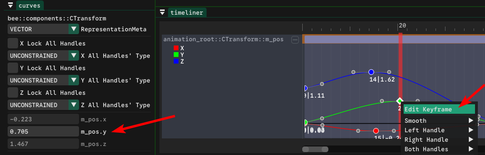

- Use **Record** mode to modify keyframes. See [Preview & Record](#preview--record) for details.

## Keyframe Restrictions

| Restriction                     | Description                                                                                                            |
| ------------------------------- | ---------------------------------------------------------------------------------------------------------------------- |
| First keyframe anchored         | Always stays at the sequence start                                                                                     |
| Last keyframe anchored          | Always stays at the sequence end                                                                                       |
| First/last deletion restricted  | Cannot delete the first or last keyframe on a curve                                                                    |
| Overlapping keyframes           | Dragging affects only the topmost keyframe. Use box selection to move multiple overlapping keyframes together          |
| Quaternion keyframes restricted | Manual keyframe movement is disabled for quaternion sequences. See [glm::quat](supported-types.md#glmquat) for details |

## Preview & Record

### Preview

**Preview** is a checkbox in the Controls window.

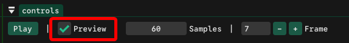

When enabled, Tanim writes sampled curve values to animated fields every frame. This shows how the animation affects entities without entering play mode.

During preview, any changes made to animated parameters through external tools (ImGuizmo, engine inspector, scripts) are immediately overwritten by Tanim. This occurs because preview displays exactly what happens during runtime playback.

To modify animations using external tools instead of Tanim overwriting them, use **Record** mode.

### Record

**Record** is a button in the Expanded Sequence window.

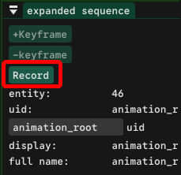

Record mode reverses the data flow: external changes to animated parameters write back to Tanim's keyframes.

**Workflow:**

1. Expand the sequence you want to modify.
2. Move the playhead to the target frame.
3. Click **Record**. Keyframes are created on any curve without one at that frame. The button changes to **Stop Recording**.
4. Modify values using external tools (ImGuizmo, inspector, scripts). Changes write to the keyframes in real time.
5. Moving the playhead or clicking **Stop Recording** ends the recording session.

**Note:** Future releases will support automatic keyframe creation when the playhead moves during recording, similar to Unity's behavior.

  <video src="https://github.com/user-attachments/assets/aa80a157-a92d-4a0c-b2ad-8716d5677bd4" width="700" height="400" controls></video>
   
  <em>Note that the top-left window titled "Gizmo Controls" is from my custom engine and is not included in Tanim.</em>

## Modifying Keyframe Handles

Tanim uses piece-wise cubic Bezier curves. Each keyframe has two handles (In and Out) that control curve shape. Adjusting handle position and properties enables fine-tuning animation flow.

Right-click a keyframe to access handle options through the context menu. The menu also works for multiple selected keyframes and disables options that cannot apply to all selected handles.

### Smooth Modes

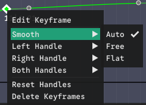

| Mode     | Description                                                                                                                   |
| -------- | ----------------------------------------------------------------------------------------------------------------------------- |
| **AUTO** | Tanim calculates smooth tangents using a monotonic Catmull-Rom algorithm. Moving keyframes recalculates affected AUTO handles |
| **FREE** | Both handles move together symmetrically, maintaining C1 continuity at the keyframe                                           |
| **FLAT** | Horizontal tangents create ease-in/ease-out effects                                                                           |

### Broken Modes

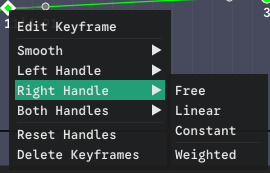

| Mode         | Description                                                          |
| ------------ | -------------------------------------------------------------------- |
| **FREE**     | Handles move independently, allowing sharp direction changes         |
| **LINEAR**   | Straight line interpolation between keyframes (handle hidden)        |
| **CONSTANT** | No interpolation, immediate value change at keyframe (handle hidden) |

### Weighted

A toggle that controls handle length calculation. When disabled, Tanim uses the 1/3 rule to calculate handle length automatically. When enabled, you can adjust length manually. Longer handles create gentler curves with larger influence regions.

### Handle Restrictions

Tanim enforces restrictions to maintain valid curves:

| Restriction                | Purpose                                                                                                                                                |
| -------------------------- | ------------------------------------------------------------------------------------------------------------------------------------------------------ |
| Handle position clamping   | Handles are constrained to neighboring keyframes to ensure monotonicity (no loops)                                                                     |
| First keyframe left handle | Modification restricted                                                                                                                                |
| Last keyframe right handle | Modification restricted                                                                                                                                |
| Constant mode left handle  | Only right handles can be set to Constant. Setting a right handle to Constant restricts the next keyframe's left handle (changes would have no effect) |
